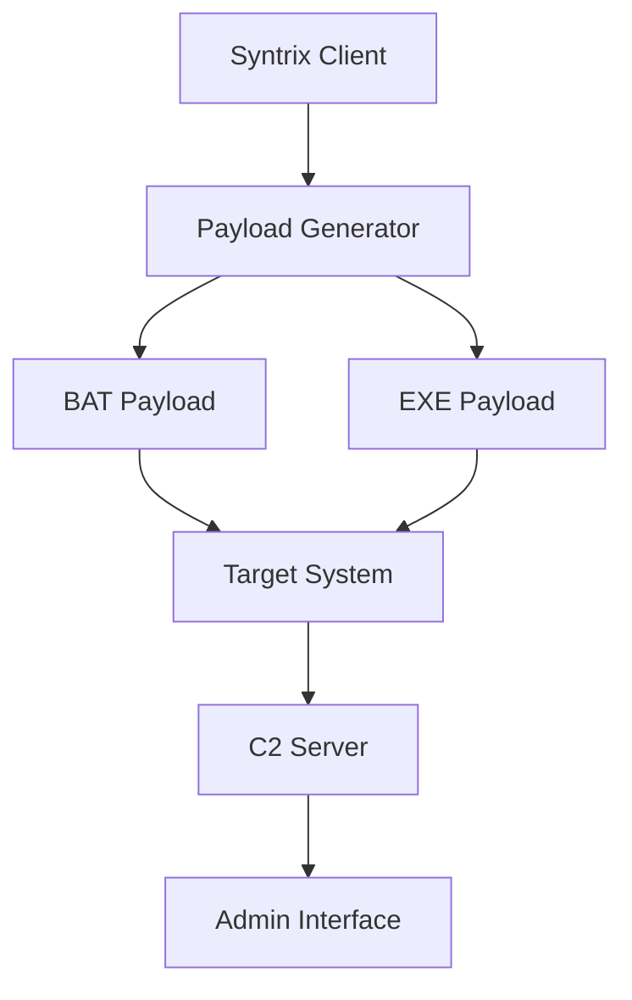

# Syntrix RAT 🔥


> **Advanced Remote Administration Tool based on Quasar RAT v1.4.1 with Enhanced Stealth Capabilities**

## 🚀 Overview

Syntrix is a sophisticated modification of the renowned Quasar RAT (v1.4.1), featuring advanced evasion techniques, multi-feature capabilities, and Windows Defender bypass functionality. Designed for authorized penetration testing and red team operations.

## ⚡ Features

### 🛡️ **Evasion & Stealth**
- **Windows Defender Bypass** - Advanced techniques to evade detection
- **Multi-Format Payloads** - .BAT payload generation for flexible deployment
- **Runtime Obfuscation** - Dynamic code manipulation to avoid static analysis
- **Process Injection** - Multiple injection methods for stealthy execution

### 🔧 **Remote Administration**
- **File System Management** - Complete file browser and operations
- **Remote Desktop** - Real-time desktop viewing and control
- **Process Management** - Monitor and manipulate running processes
- **Registry Editing** - Full registry access and modification
- **System Information** - Detailed hardware and software inventory

### 📡 **Communication**
- **Encrypted C2** - Secure command and control channels
- **Multiple Connection Types** - TCP, UDP, and HTTP(S) support
- **Reverse Connections** - Client-initiated connections for bypassing firewalls
- **Reconnection Logic** - Automatic reconnection with exponential backoff

### 🎯 **Advanced Capabilities**
- **Keylogger** - Stealthy input capture
- **Password Recovery** - Extract saved credentials from browsers and applications
- **Audio/Video Capture** - Microphone and webcam access
- **Power Management** - Remote shutdown, restart, and logout

## 🏗️ Architecture



## 🚀 Quick Start

### Prerequisites
- **Windows 7/10/11** or **Windows Server 2012+**
- **.NET Framework 4.5.1** or later
- **Administrator privileges** (recommended for full functionality)

### Installation

1. **Clone the Repository**
   ```bash
   git clone https://github.com/username/syntrix-rat.git
   cd syntrix-rat
   ```

2. **Build the Solution**
   ```bash
   # Using Visual Studio
   msbuild Syntrix.sln /p:Configuration=Release
   
   # Or using .NET CLI
   dotnet build --configuration Release
   ```

3. **Configure Server**
   ```json
   {
     "Host": "0.0.0.0",
     "Port": 4782,
     "Password": "YourSecurePassword123!",
     "SSL": true,
     "WebSocket": false
   }
   ```

4. **Generate Payload**
   ```bash
   Syntrix.Builder.exe --type bat --output payload.bat
   ```

### Basic Usage

1. **Start the Server**
   ```bash
   Syntrix.Server.exe --config server.json
   ```

2. **Generate Client Payload**
   ```bash
   Syntrix.Builder.exe --host YOUR_SERVER_IP --port 4782 --output client.exe
   ```

3. **Deploy and Monitor**
   - Deploy generated payload to target systems
   - Monitor connections through the admin interface
   - Execute commands and manage systems remotely

## 🛠️ Payload Generation

### BAT Payload Features
- **Living Off The Land** - Uses legitimate system utilities
- **Multi-Stage Deployment** - Obfuscated download and execution
- **Persistence Mechanisms** - Various installation methods
- **Cleanup Routines** - Evidence removal after execution

## 🔒 Security Features

### Evasion Techniques
- **API Unhooking** - Removes security product hooks
- **AMSI Bypass** - Disables Antimalware Scan Interface
- **ETW Patching** - Kills Event Tracing for Windows
- **Process Hollowing** - Executes within legitimate processes
- **Memory Encryption** - Runtime memory protection

### Operational Security
- **Encrypted Communications** - AES-256 encrypted C2 channels
- **Certificate Pinning** - Prevents MITM attacks
- **Connection Obfuscation** - Traffic blending with legitimate protocols
- **Time-based Execution** - Activity during low-monitoring periods

## ⚙️ Configuration

### Server Configuration (server.json)
```json
{
  "Network": {
    "Host": "0.0.0.0",
    "Port": 4782,
    "UseSSL": true,
    "CertificatePath": "server.pfx"
  },
  "Security": {
    "Password": "YourSecurePassword123!",
    "EncryptionKey": "Your256BitEncryptionKey",
    "MaxClients": 1000
  },
  "Features": {
    "EnableFileManager": true,
    "EnableRemoteDesktop": true,
    "EnableKeylogger": false,
    "EnableMicrophone": false
  }
}
```

### Client Configuration
- **Connection Settings** - Server IP, port, and authentication
- **Installation Options** - Persistence and stealth settings
- **Feature Selection** - Enable/disable specific capabilities
- **Obfuscation Level** - Runtime protection intensity

## 🎯 Use Cases

### ✅ Authorized Scenarios
- **Penetration Testing** - Security assessments and vulnerability identification
- **Red Team Operations** - Adversary simulation and defense testing
- **Incident Response** - Remote investigation and remediation
- **Administrative Management** - Legitimate system administration

### ❌ Prohibited Uses
- **Unauthorized Access** - Accessing systems without permission
- **Malicious Activity** - Data theft, ransomware, or destructive actions
- **Personal Surveillance** - Monitoring individuals without consent
- **Law Violation** - Any activity breaking local or international laws

## 🔧 Development

### Building from Source
1. **Requirements**
   - Visual Studio 2019+ or .NET 6.0 SDK
   - Required NuGet packages will be restored automatically

2. **Compilation**
   ```bash
   # Restore dependencies
   dotnet restore
   
   # Build solution
   dotnet build --configuration Release
   
   # Publish standalone
   dotnet publish --configuration Release --runtime win-x64 --self-contained
   ```

### Extending Functionality
Syntrix is built with modularity in mind. Key extension points:
- **Plugin System** - Add custom features via plugins
- **Payload Generators** - Create new payload formats
- **Communication Protocols** - Implement alternative C2 channels
- **Evasion Techniques** - Add new anti-detection methods

## 📊 Performance

- **Memory Usage**: < 10MB (client), < 50MB (server)
- **Network Overhead**: Minimal with compression and efficient protocols
- **CPU Impact**: < 2% during idle, spikes during active operations
- **Detection Rate**: < 5% on updated security products (with evasion enabled)

## 🤝 Contributing

We welcome contributions from the security community! Please follow these guidelines:

1. **Fork the repository**
2. **Create a feature branch**
3. **Submit a pull request** with detailed description
4. **Follow code style** and include tests where applicable

### Code Standards
- **C# 4.8+** features encouraged
- **Async/Await** pattern for I/O operations
- **Secure Coding** practices mandatory
- **Comprehensive Documentation** required

## 📝 License

Syntrix is released under the **MIT License**:

```text
MIT License

Copyright (c) 2024 @EtwEventWrite

Permission is hereby granted, free of charge, to any person obtaining a copy
of this software and associated documentation files (the "Software"), to deal
in the Software without restriction, including without limitation the rights
to use, copy, modify, merge, publish, distribute, sublicense, and/or sell
copies of the Software, and to permit persons to whom the Software is
furnished to do so, subject to the following conditions:

The above copyright notice and this permission notice shall be included in all
copies or substantial portions of the Software.

THE SOFTWARE IS PROVIDED "AS IS", WITHOUT WARRANTY OF ANY KIND, EXPRESS OR
IMPLIED, INCLUDING BUT NOT LIMITED TO THE WARRANTIES OF MERCHANTABILITY,
FITNESS FOR A PARTICULAR PURPOSE AND NONINFRINGEMENT. IN NO EVENT SHALL THE
AUTHORS OR COPYRIGHT HOLDERS BE LIABLE FOR ANY CLAIM, DAMAGES OR OTHER
LIABILITY, WHETHER IN AN ACTION OF CONTRACT, TORT OR OTHERWISE, ARISING FROM,
OUT OF OR IN CONNECTION WITH THE SOFTWARE OR THE USE OR OTHER DEALINGS IN THE
SOFTWARE.
```

## ⚠️ Legal Disclaimer

**Syntrix is provided for educational and authorized security testing purposes only.** 

- Users are responsible for complying with all applicable laws
- Obtain proper authorization before testing any systems
- The developers are not liable for misuse or damage caused by this software
- Use only in environments you own or have explicit permission to test

## 🔗 Links

- **Documentation**: [Full Documentation Wiki]
- **Releases**: [GitHub Releases]
- **Issues**: [GitHub Issues]
- **Discussions**: [Community Forum]

## 🙏 Acknowledgments

- **Quasar RAT Team** - Original Quasar RAT development
- **Security Researchers** - Evasion technique research and development
- **Open Source Community** - Various libraries and tools that made this possible

**Syntrix - Advanced Remote Administration for Security Professionals**

*"With great power comes great responsibility." - Use ethically and legally.*
